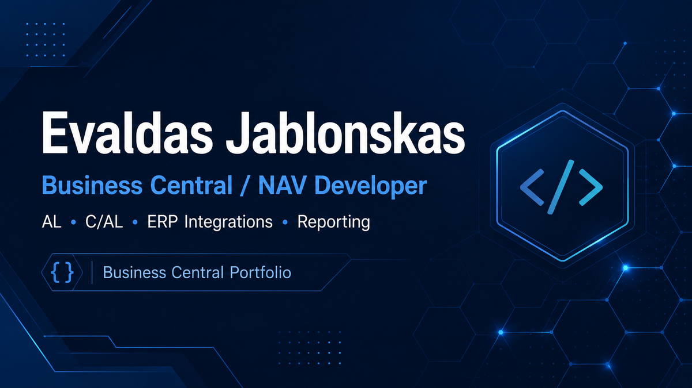

# Evaldas Jablonskas

Microsoft Dynamics 365 Business Central / NAV Developer with over 10 years of ERP development experience.

## Selected Projects

- [Lithuanian IBAN Bank Account Autofill](https://github.com/evkanas/business-central-lithuanian-iban-bank-account-autofill)  
  Business Central AL portfolio project for autofilling customer and vendor bank account cards from Lithuanian IBAN bank codes.
- [BC Azure Invoice Archive](https://github.com/evkanas/bc-azure-invoice-archive)  
  Business Central AL portfolio project for emailing posted sales invoices and archiving invoice documents to Azure Blob Storage.
- [BC Reconciliation Acts](https://github.com/evkanas/bc-reconciliation-acts)  
  Business Central AL portfolio project for generating customer and vendor reconciliation statements.
- [BC Omniva E-Invoice Connector](https://github.com/evkanas/bc-omniva-einvoice-connector)  
  Business Central AL portfolio project for importing Omniva digitized supplier invoices into Business Central purchase invoices through a SOAP API and XML processing.

## Expertise

- Microsoft Dynamics 365 Business Central
- Microsoft Dynamics NAV
- AL Development
- C/AL Development
- ERP Integrations
- SQL
- Reporting
- Document Handling
- Process Automation

## Profiles

- [Evaldas Jablonskas on GitHub](https://github.com/evkanas)
- [Evaldas Jablonskas on LinkedIn](https://www.linkedin.com/in/evaldas-jablonskas-5b45a794/)

## Technical Articles

Technical notes by **Evaldas Jablonskas** about Microsoft Dynamics 365 Business Central, AL development, and portfolio projects.

* Business Central Lithuanian IBAN Bank Account Autofill

## Professional Community and Team Events

Public moments from professional community and team activities related to my work environment.

- [OIXIO Team Kayaking Event](oixio-team-kayaking-event/)
- [OIXIO Team Trip to Turkey](oixio-team-trip-turkey/)

## Informacija lietuviškai

Esu Microsoft Dynamics 365 Business Central ir Dynamics NAV programuotojas, dirbantis su AL ir C/AL programavimu, ataskaitomis, integracijomis, duomenų apdorojimu ir verslo procesų automatizavimu.

Praktinė patirtis apima Business Central ir NAV funkcionalumo pritaikymą pagal įmonės poreikius: RDLC ir Excel ataskaitas, sąskaitų importą, el. sąskaitas, banko duomenų apdorojimą, pirkėjų ir tiekėjų likučių derinimą, skolų suderinimo aktus, dokumentų apdorojimą, sandėlio procesus ir individualius sistemos pakeitimus.

Dirbu tiek su naujesniais Business Central AL sprendimais, tiek su senesnėmis Dynamics NAV / Navision versijomis, kuriose dažnai reikalingi C/AL pakeitimai, ataskaitų koregavimas, veikimo optimizavimas ar integracijų pritaikymas.
