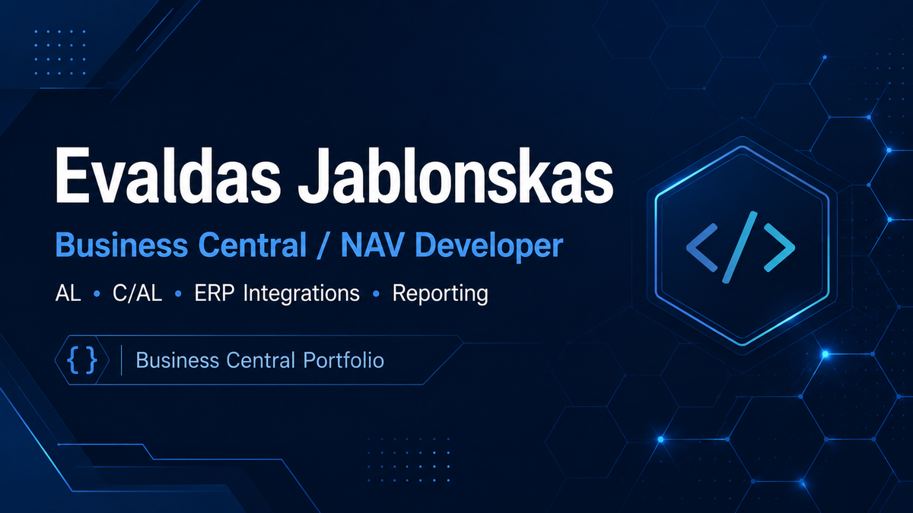

# Evaldas Jablonskas

Microsoft Dynamics 365 Business Central / NAV Developer with over 10 years of ERP development experience.

## Selected Projects

- [Lithuanian IBAN Bank Account Autofill](https://github.com/evkanas/business-central-lithuanian-iban-bank-account-autofill)  
  Business Central AL portfolio project for autofilling customer and vendor bank account cards from Lithuanian IBAN bank codes.
- [BC Azure Invoice Archive](https://github.com/evkanas/bc-azure-invoice-archive)  
  Business Central AL portfolio project for emailing posted sales invoices and archiving invoice documents to Azure Blob Storage.
- [BC Reconciliation Acts](https://github.com/evkanas/bc-reconciliation-acts)  
  Business Central AL portfolio project for generating customer and vendor reconciliation statements.
- [BC Omniva E-Invoice Connector](https://github.com/evkanas/bc-omniva-einvoice-connector)  
  Business Central AL portfolio project for importing Omniva digitized supplier invoices into Business Central purchase invoices through a SOAP API and XML processing.

## Expertise

- Microsoft Dynamics 365 Business Central
- Microsoft Dynamics NAV
- AL Development
- C/AL Development
- ERP Integrations
- SQL
- Reporting
- Document Handling
- Process Automation

## Profiles

- <a href="https://github.com/evkanas" target="_blank" rel="noopener noreferrer">Evaldas Jablonskas on GitHub</a>
- <a href="https://www.linkedin.com/in/evaldas-jablonskas-5b45a794/" target="_blank" rel="noopener noreferrer">Evaldas Jablonskas on LinkedIn</a>
- <a href="https://www.facebook.com/profile.php?id=61591523192102" target="_blank" rel="noopener noreferrer">Daugiabučio įgaliotinio užrašai on Facebook</a>
- <a href="https://www.instagram.com/igaliotinio.uzrasai/" target="_blank" rel="noopener noreferrer">Daugiabučio įgaliotinio užrašai on Instagram</a>
- <a href="https://www.youtube.com/@DaugiabucioIgaliotinioUzrasai" target="_blank" rel="noopener noreferrer">Daugiabučio įgaliotinio užrašai on YouTube</a>
- <a href="https://x.com/igaliotinis_lt" target="_blank" rel="noopener noreferrer">Daugiabučio įgaliotinio užrašai on X</a>
- <a href="https://www.tiktok.com/@igaliotiniouzrasai" target="_blank" rel="noopener noreferrer">Daugiabučio įgaliotinio užrašai on TikTok</a>

## Technical Articles

Technical notes and portfolio articles by **Evaldas Jablonskas** about Microsoft Dynamics 365 Business Central, Dynamics NAV, AL development, integrations, reporting, and process automation.

- [Business Central Lithuanian IBAN Bank Account Autofill – automatinis banko duomenų užpildymas pagal IBAN](https://evaldasjablonskas.lt/business-central-lithuanian-iban-bank-account-autofill/)  **Evaldo Jablonsko** portfolio straipsnis apie automatinį pirkėjų ir tiekėjų banko sąskaitų duomenų užpildymą pagal lietuviško IBAN banko kodą.
- [Business Central ir OpenCart integracija – ERP ir e. prekybos automatizavimo koncepcija](/business-central-opencart-integration/) **Evaldo Jablonsko** portfolio straipsnis apie **Microsoft Dynamics 365 Business Central / NAV** ir **OpenCart** integraciją: prekes, variantus, likučius, kainas ir užsakymus.
- [Evaldas Jablonskas – Business Central Finbite / Omniva Invoice Center Integration](/business-central-finbite-omniva-invoice-center-integration/)
  Microsoft Dynamics 365 Business Central / NAV portfolio straipsnis apie tiekėjų sąskaitų importą iš buvusio Omniva Invoice Center / Finbite tipo sąskaitų administravimo sprendimo per SOAP API ir XML apdorojimą.
- [EVK Solution Agent – DI agentas el. laiškų ir tekstų analizei](/evk-solution-agent/)

## Evaldas Jablonskas – Daugiabučio įgaliotinio užrašai

Evaldas Jablonskas asmeninės patirties pagrindu rašo apie daugiabučio įgaliotinio vaidmenį, daugiabučio administravimą, gyventojų savivaldą ir savivaldybės atsakomybės ribas.

* [Evaldas Jablonskas – Daugiabučio įgaliotinio užrašai](/daugiabucio-igaliotinio-uzrasai/)  
  Straipsnių ciklas apie daugiabučio įgaliotinio patirtį, administravimo ribas, statytojų defektus ir institucijų atsakomybę.
* [Vadovai keičiasi, vanduo bėga: kai NT rinkos „rokiruotės“ tampa fasadu, už kurio džiūsta tik vystytojų sąžinė](/daugiabucio-igaliotinio-uzrasai/citus-omberg-garantines-prieziuros-rokiruote/)  
  Evaldo Jablonsko straipsnis apie „Citus“ ir „Omberg“ garantinės priežiūros specialistų rokiruotę, Marių Karpavičių, Robertą Balašaitį ir neišspręstus statybos defektus.
* [„Citus“ garantija: popierius, kuris ištirpsta greičiau nei pavasario sniegas](/daugiabucio-igaliotinio-uzrasai/citus/citus-garantija/)  
  Evaldo Jablonsko straipsnis apie „Citus“ garantinius darbus, vandens skverbimąsi į parkingą, po remonto atsiradusią žalą ir besikeičiančius atsakingus darbuotojus.
* [Seimo kontrolierė Erika Leonaitė pati sugalvojo mano prašymą – ir pati į jį atsakė](/daugiabucio-igaliotinio-uzrasai/seimo-kontrolieriai/erika-leonaite-atsakymas/)  
  Seimo kontrolierei Erikai Leonaitei pateikiau keturis konkrečius klausimus. Oficialiame atsakyme mano prašymo turinys buvo pakeistas, o į pačius klausimus neatsakyta.
* [Evaldas Jablonskas: Aš – „valstybės priešas“ Lauryno Kasčiūno akivaizdoje](/daugiabucio-igaliotinio-uzrasai/savivaldybe/laurynas-kasciunas-valstybes-priesas/)  
  Evaldo Jablonsko straipsnis apie Lauryno Kasčiūno tylą, Vilniaus savivaldybės administracinį spaudimą ir „Citus“ garantinių defektų istoriją.
* [UAB „Prokuratūra“: kai bendruomenės gynimas prilyginamas nusikaltimui](/daugiabucio-igaliotinio-uzrasai/prokuratura/uab-prokuratura-bendruomenes-gynimas/)  
  Evaldo Jablonsko straipsnis apie situaciją, kai daugiabučio bendruomenės interesų gynimas, statybų broko viešinimas ir kreipimaisi į verslo asociacijas virto baudžiamuoju įtarimu.
* [Kai savivaldybė daugiabučio įgaliotinį prilygina administratoriui](/daugiabucio-igaliotinio-uzrasai/savivaldybe/)
  Evaldo Jablonsko straipsnis apie situaciją, kai savivaldybė daugiabučio įgaliotinį vertina kaip administratorių ar pastato valdytoją.
* [VVTAT – vartotojų gynėja ar dar viena biurokratinė siena?](/daugiabucio-igaliotinio-uzrasai/vvtat/vvtat-vartotoju-gyneja-ar-dar-viena-biurokratine-siena/)  
  Evaldo Jablonsko straipsnis apie daugiabučio įgaliotinio patirtį kreipiantis į VVTAT dėl administratoriaus apskaičiuoto mokesčio, įgaliotinio statuso ir institucinių dokumentų reikalavimų.

* [Ar verta pirkti butą iš „Citus“? Viešas klausimas Mindaugui Vanagui dėl užliejamo parkingo](/daugiabucio-igaliotinio-uzrasai/citus/mindaugas-vanagas-uzliejamas-parkingas/)  
  Evaldo Jablonsko straipsnis apie nuo 2023 metų fiksuojamą vandens skverbimąsi į požeminį parkingą ir viešus klausimus „Citus“ įkūrėjui Mindaugui Vanagui.
* [„Citus“ atsiliepimai ir pirkėjų patirtis: ko tikėtis susidūrus su šiuo NT vystytoju?](/daugiabucio-igaliotinio-uzrasai/citus/citus-atsiliepimai/)  
  Evaldo Jablonsko straipsnis apie viešus „Citus“ atsiliepimus, pirkėjų patirtis, garantinių defektų šalinimą, vandens pratekėjimus ir preliminariųjų sutarčių rizikas.
* [Į elektros skydinę – su skėčiu? Viešas klausimas „Citus“ garantinio skyriaus vadovui Mariui Karpavičiui](/daugiabucio-igaliotinio-uzrasai/citus/marius-karpavicius-elektros-skydine-vanduo/)  
  Evaldo Jablonsko straipsnis apie oficialiame statinio apžiūros akte užfiksuotą vandens patekimą į požeminio parkingo elektros skydinės zoną ir klausimus „Citus“ garantinio skyriaus vadovui Mariui Karpavičiui.
* [Pilietinio aktyvumo kaina Vilniuje: Valdas Benkunskas, Adomas Bužinskas ir daugiabučio įgaliotinis](/daugiabucio-igaliotinio-uzrasai/savivaldybe/pilietinio-aktyvumo-kaina-vilniuje/)
  Evaldo Jablonsko straipsnis apie pilietinio aktyvumo kainą Vilniuje, Vilniaus savivaldybę ir administracinio spaudimo riziką aktyviam gyventojų atstovui.

<!--
Ateities straipsnių idėjos:

1. Ka realiai daro daugiabučio įgaliotinis
   Galimas būsimas URL:
   /daugiabucio-igaliotinio-uzrasai/ka-realiai-daro-daugiabucio-igaliotinis/

2. ANK 505 straipsnio taikymo užkulisiai
   Galimas būsimas URL:
   /daugiabucio-igaliotinio-uzrasai/ank-505/

Svarbu:
Kol straipsniai realiai nesukurti, aktyvių nuorodų į juos nedėti nei landing page, nei sitemap.xml.
-->

## Professional Community and Team Events

Public moments from professional community and team activities related to my work environment.

- [OIXIO Team Kayaking Event](https://evaldasjablonskas.lt/oixio-team-kayaking-event/)
- [OIXIO Team Trip to Turkey](https://evaldasjablonskas.lt/oixio-team-trip-turkey/)

## Informacija lietuviškai

Esu Microsoft Dynamics 365 Business Central ir Dynamics NAV programuotojas, dirbantis su AL ir C/AL programavimu, ataskaitomis, integracijomis, duomenų apdorojimu ir verslo procesų automatizavimu.

Praktinė patirtis apima Business Central ir NAV funkcionalumo pritaikymą pagal įmonės poreikius: RDLC ir Excel ataskaitas, sąskaitų importą, el. sąskaitas, banko duomenų apdorojimą, pirkėjų ir tiekėjų likučių derinimą, skolų suderinimo aktus, dokumentų apdorojimą, sandėlio procesus ir individualius sistemos pakeitimus.

Dirbu tiek su naujesniais Business Central AL sprendimais, tiek su senesnėmis Dynamics NAV / Navision versijomis, kuriose dažnai reikalingi C/AL pakeitimai, ataskaitų koregavimas, veikimo optimizavimas ar integracijų pritaikymas.
