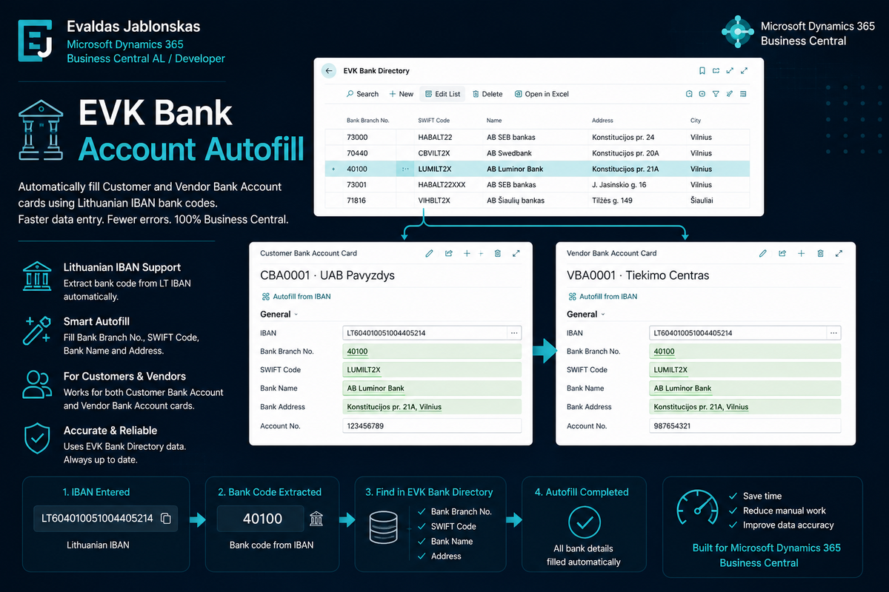

# Business Central Lithuanian IBAN Bank Account Autofill – automatinis banko duomenų užpildymas pagal IBAN



**Business Central Lithuanian IBAN Bank Account Autofill** yra praktinis Microsoft Dynamics 365 Business Central AL extension pavyzdys. Projektas skirtas automatiškai užpildyti pirkėjo arba tiekėjo banko sąskaitos duomenis pagal lietuvišką IBAN numerį.

Tai portfolio projektas, rodantis praktinį Business Central, AL development, page extension, codeunit ir lokalizavimo scenarijaus panaudojimą Lietuvos rinkai.

## Problema

Business Central sistemoje pildant `Customer Bank Account` arba `Vendor Bank Account` kortelę dalį banko duomenų dažnai tenka įvesti rankiniu būdu.

Įprastai reikia pildyti banko pavadinimą, SWIFT kodą, adresą, miestą, pašto kodą ir kitus kontaktinius duomenis. Kai tie patys banko rekvizitai kartojasi daugelyje pirkėjų ar tiekėjų banko sąskaitų, toks rankinis pildymas tampa nepatogus ir didina klaidų tikimybę.

Lietuviškame IBAN numeryje yra banko kodas, todėl šią informaciją galima panaudoti automatiniam banko duomenų užpildymui.

## Sprendimo idėja

Šiame projekte sukurtas Business Central AL extension, kuris reaguoja į IBAN lauko pakeitimą `Customer Bank Account` ir `Vendor Bank Account` kortelėse.

Kai vartotojas įveda IBAN numerį, prasidedantį `LT`, sistema iš IBAN paima Lietuvos banko kodą ir pagal jį ieško atitinkamo įrašo `EVK Bank Directory` kataloge.

Jeigu bankas randamas, į banko sąskaitos kortelę automatiškai užpildomi banko rekvizitai.

Bendra logika:

```text
IBAN → banko kodas → EVK Bank Directory → Customer/Vendor Bank Account
```

## Kaip veikia

Lietuviško IBAN pavyzdys:

```text
LT604010051004405214
```

Šiame IBAN banko kodas yra:

```text
40100
```

Pagal šį kodą ieškoma įrašo `EVK Bank Directory` lentelėje. Kataloge esantis `Bank Branch No.` turi atitikti iš IBAN ištrauktą banko kodą.

Jeigu toks įrašas randamas, Business Central kortelėje automatiškai užpildomi banko duomenys.

## Kokie duomenys užpildomi

Pagal bankų katalogo įrašą gali būti užpildomi šie `Customer Bank Account` arba `Vendor Bank Account` laukai:

- `Bank Branch No.`
- `SWIFT Code`
- banko pavadinimas
- adresas
- miestas
- pašto kodas
- telefono numeris
- el. paštas
- svetainė
- kontaktinis asmuo

Tai sumažina rankinio darbo kiekį ir padeda palaikyti nuoseklesnius banko rekvizitus skirtingose pirkėjų ir tiekėjų kortelėse.

## Techninė realizacija

Sprendime verslo logika atskirta nuo vartotojo sąsajos.

`Page extension` objektai naudojami tik tam, kad būtų sureaguota į IBAN lauko pasikeitimą standartinėse Business Central kortelėse. Pati banko kodo ištraukimo, bankų katalogo paieškos ir laukų užpildymo logika iškelta į bendrą `codeunit`.

Toks sprendimas leidžia išvengti logikos dubliavimo, nes `Customer Bank Account` ir `Vendor Bank Account` kortelėse naudojamas tas pats principas.

Jeigu ateityje reikėtų pakeisti IBAN analizavimo taisykles, papildyti užpildomų laukų sąrašą arba pakeisti banko katalogo paiešką, pagrindiniai pakeitimai būtų atliekami vienoje vietoje.

## Kodėl nenaudojamas CurrPage.SaveRecord()

Šiame sprendime nenaudojamas `CurrPage.SaveRecord()`.

Tai sąmoningas sprendimas, nes automatinis įrašo išsaugojimas lauko validacijos metu gali sukelti nepageidaujamą šalutinį poveikį. Vartotojas dar gali būti neužbaigęs kortelės pildymo, todėl priverstinis įrašo išsaugojimas nebūtų geras sprendimas.

Extension užpildo reikalingus laukus, o įrašo išsaugojimas paliekamas standartiniam Business Central veikimui ir vartotojo veiksmams.

## Esamo banko sąskaitos kodo neperrašymas

Projektas nekeičia banko sąskaitos `Code` lauko.

Business Central aplinkoje šis laukas dažnai naudojamas kaip identifikatorius. Įmonės gali turėti savo vidines taisykles, kaip koduojamos pirkėjų ar tiekėjų banko sąskaitos.

Todėl automatizavimas pildo banko rekvizitus, bet nekeičia vartotojo arba įmonės pasirinkto banko sąskaitos kodo.

## Elgsena, kai banko kodas nerandamas

Jeigu pagal IBAN rastas banko kodas neegzistuoja `EVK Bank Directory` kataloge, klaida nemetama.

Tai leidžia vartotojui tęsti darbą ir banko duomenis užpildyti rankiniu būdu. Toks veikimas pasirinktas todėl, kad bankų katalogas gali būti nepilnas arba dar neatnaujintas.

Automatizavimas čia veikia kaip pagalbinė funkcija, o ne kaip griežtas validavimo mechanizmas.

## Apribojimai

Šis projektas nėra pilna IBAN validavimo sistema. Jis netikrina IBAN checksum ir negarantuoja, kad įvestas IBAN numeris yra galiojantis.

Taip pat projektas negarantuoja, kad bankų kataloge esantys duomenys visada yra aktualūs. Production aplinkoje reikėtų aiškiai apsibrėžti, kas prižiūri bankų katalogą ir kaip jis atnaujinamas.

Projektas sukurtas kaip praktinis Business Central AL development portfolio pavyzdys.

## Ką šis projektas demonstruoja

Šis projektas demonstruoja kelis praktinius Business Central AL development aspektus:

- standartinių Business Central kortelių išplėtimą naudojant `page extension`;
- bendros verslo logikos iškėlimą į `codeunit`;
- darbą su atskira bankų katalogo lentele;
- banko kodo ištraukimą iš lietuviško IBAN;
- automatinį `Customer Bank Account` ir `Vendor Bank Account` laukų pildymą;
- atsargų požiūrį į duomenų pildymą be priverstinio įrašo išsaugojimo;
- praktinį lokalizavimo scenarijų Lietuvos rinkai.

Tai nedidelis, bet praktiškas Business Central extension pavyzdys, parodantis, kaip AL kalba galima automatizuoti pasikartojantį duomenų pildymo procesą.

## GitHub repository

Source code is available on GitHub:

[Business Central Lithuanian IBAN Bank Account Autofill](https://github.com/evkanas/business-central-lithuanian-iban-bank-account-autofill)

## English summary

Business Central Lithuanian IBAN Bank Account Autofill is a Microsoft Dynamics 365 Business Central AL extension that automatically fills Lithuanian customer and vendor bank account details based on the bank code found in the IBAN number.

The project demonstrates AL development, page extensions, codeunit-based business logic, a configurable bank directory, and a practical automation scenario for Business Central.
